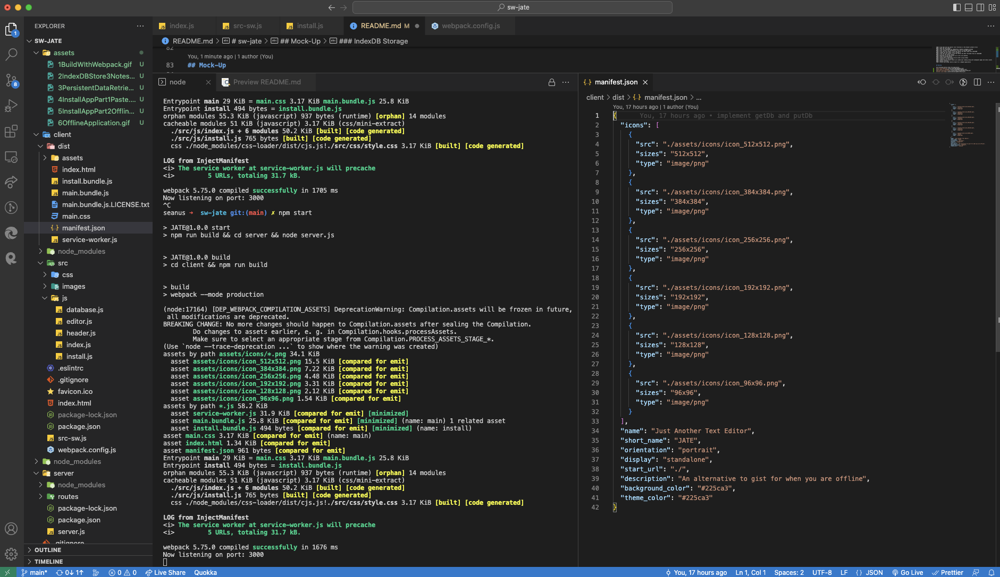
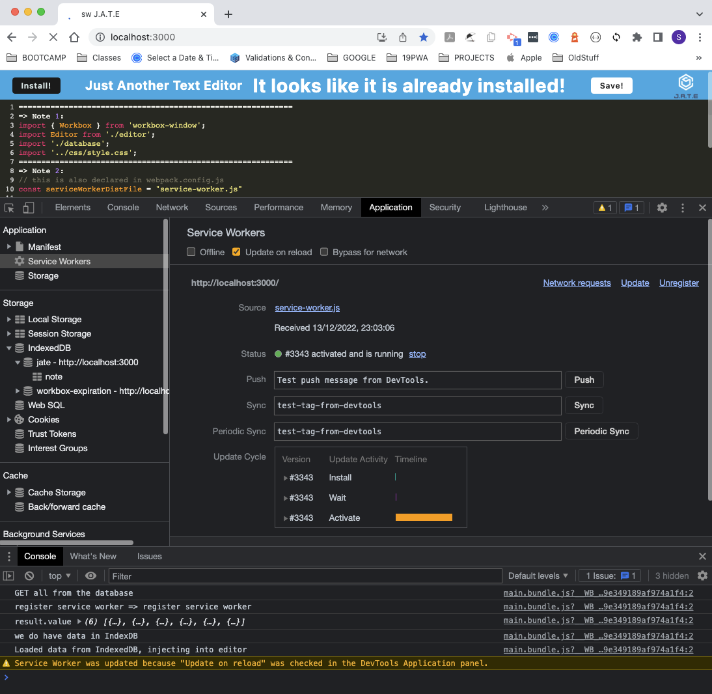
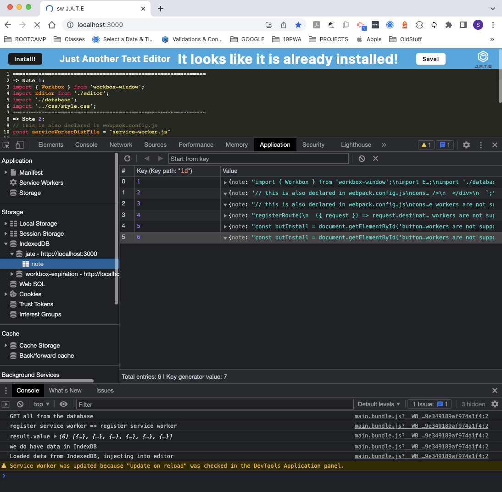

# sw-jate
-----
 
## Description
JATE (Just another text editor) is a single-page Progressive Web Application (PWA) text editor that can be used online and offline (data persistence is with IndexDB).

## Table of Contents

- [Installation](#installation)
- [Usage](#usage)
- [Technologies Used](#technologies-used)
- [User Story](#user-story)
- [Mock-up](#mock-up)
- [License](#license)
- [Repository](#repository)
- [Author](#author)

## Installation
1. Clone the app from the repository
2. In the project folder: npm install
3. In the terminal: npm start

## Usage
 1. In your browser: load [J.A.T.E](http://localhost:3000)
It runs on port 3000.

## Technologies Used

### Front-end
 - HTML
 - JavaScript/JQuery
 - Express
 - MiniCSS extract plugin
 - Webpack
 - idb for IndexDB
 - Babel
 - code-mirror-themes
 
### Back-end Dependencies
 - node.js
 - Express
 - if-env
 - concurrently
 - nodemon


## User Story

```md
AS A developer
I WANT to create notes or code snippets with or without an internet connection
SO THAT I can reliably retrieve them for later use
```
## Acceptance Criteria

```md
GIVEN a text editor web application
WHEN I open my application in my editor
THEN I should see a client server folder structure
WHEN I run `npm run start` from the root directory
THEN I find that my application should start up the backend and serve the client
WHEN I run the text editor application from my terminal
THEN I find that my JavaScript files have been bundled using webpack
WHEN I run my webpack plugins
THEN I find that I have a generated HTML file, service worker, and a manifest file
WHEN I use next-gen JavaScript in my application
THEN I find that the text editor still functions in the browser without errors
WHEN I open the text editor
THEN I find that IndexedDB has immediately created a database storage
WHEN I enter content and subsequently click off of the DOM window
THEN I find that the content in the text editor has been saved with IndexedDB
WHEN I reopen the text editor after closing it
THEN I find that the content in the text editor has been retrieved from our IndexedDB
WHEN I click on the Install button
THEN I download my web application as an icon on my desktop
WHEN I load my web application
THEN I should have a registered service worker using workbox
WHEN I register a service worker
THEN I should have my static assets pre cached upon loading along with subsequent pages and static assets
WHEN I deploy to Heroku
THEN I should have proper build scripts for a webpack application
```

## Mock-Up

The following mock-up shows the application:
[Build with Webpack](./assets/1BuildWIthWebpack.gif)
[Store Notes in IndexDB](./assets/2IndexDBStore3Notes.gif)
[Retrieve Persistent Data](./assets/3PersistentDataRetrieved.gif)
[Install Local App](./assets/4InstallAppPart1Paste.gif)
[Working Offline](./assets/5InstallAppPart2Offline.gif)
[Uninstalling App](./assets/6OfflineApplication.gif)

### Manifest.json

### Registered Service Worker

### IndexDB Storage


## License
 This application is licencsed under [MIT license](https://opensource.org/licenses/MIT).
## Repository
https://github.com/SeanU2022/sw-jate

## Deployed Application
https://sw-jate.herokuapp.com/

## Author
 - Sean Wallace: https://github.com/SeanU2022
